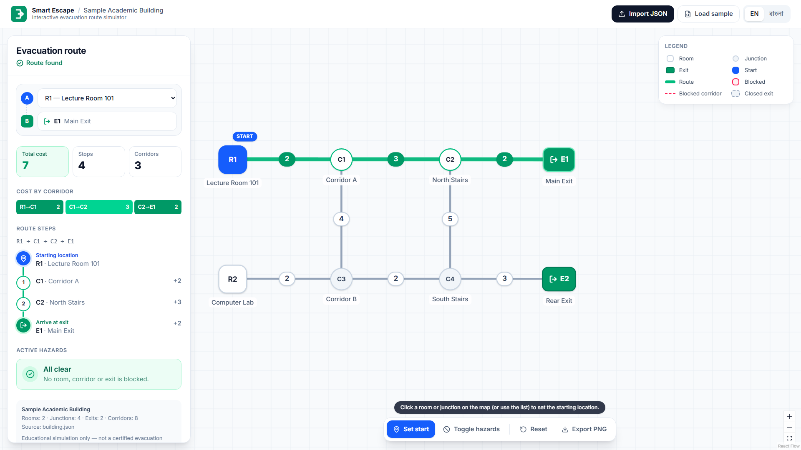
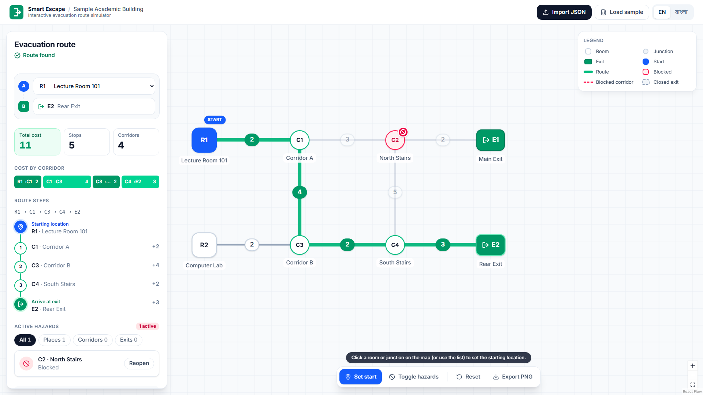

# demo--devfest-01947966420-

## Smart Escape — Interactive Evacuation Route Simulator

A frontend-only web app that shows a building map, finds the lowest-cost route from a chosen
starting location to an open exit, and recalculates instantly when rooms, corridors or exits are
blocked. Works in **English and Bangla**.

> Educational simulation only — not a certified evacuation planning tool.

| | |
|---|---|
| **Name** | _your full name_ |
| **Registration number** | _your registration number_ |
| **Live link** | _add the public HTTPS link after deploying_ |

## Screenshots

| Baseline (R1 → E1, cost 7) | C2 blocked (R1 → E2, cost 11) |
|---|---|
|  |  |

## How to run

```bash
npm install
npm run dev      # http://localhost:5173
npm test         # routing + validation tests
npm run build    # static build in dist/
```

Deploy `dist/` to any static host (Vercel, Netlify, Cloudflare Pages, GitHub Pages).
On Vercel/Netlify: build command `npm run build`, output directory `dist`.

## Main features (all done)

- **Import & map** — import `building.json` (button or drag-and-drop), strict validation with
  clear errors, nodes drawn at the file's coordinates, distinct room / junction / exit shapes,
  readable labels and visible corridor costs.
- **Select & calculate** — choose a start by clicking a room/junction or from the list; the
  lowest-cost route is highlighted with its node sequence, exit and total cost.
- **Change conditions** — "Toggle hazards" mode: click a room/junction to block it, a corridor
  (or its cost badge) to block it, an exit to close it; click again to undo. Each state has its own look.
- **Update & reset** — every change recalculates immediately; Reset restores the file's `initial_state`.
- **Failure cases** — "No route available" and "Starting location blocked".
- **Two languages** — every label, button, status, error and instruction in English and Bangla
  (Bangla digits included). Dataset labels stay unchanged.
- **Animations** — route draws edge by edge, start selection pops, hazard badges and panels fade in.
  Respects `prefers-reduced-motion`.

### Routing rules
Dijkstra over corridor costs only (coordinates are display-only). Blocked nodes and their
corridors, blocked corridors and closed exits are excluded; exits end a route. Among reachable
exits the cheapest wins; ties → smallest exit ID, then the lexicographically smallest node-ID
sequence (case-sensitive, plain string comparison).

## Bonus features

- PNG export of the map
- Accessible controls: keyboard-focusable nodes and cost badges with screen-reader labels,
  start dropdown, removable hazard chips, live result announcements
- Drag-and-drop import, zoom / pan / fit controls
- Language choice remembered in `localStorage`
- Shareable demo URLs: `?start=R1&block=C2&close=E1&mode=hazard&lang=bn`
- Test files in `public/samples/` (tie-break, disconnected graph, invalid file) and 13 automated tests

## Known problems

- ID tie-breaks use plain string order, so `C10` sorts before `C2`.
- Very dense graphs (close to 60 nodes) can have overlapping labels; zoom in to read them.
- The PNG export uses system fonts.

## UI design references (Mobbin)

- Full-screen map with a floating route panel and A/B waypoints — komoot
- Status line ("Route found") and breadcrumb top bar — OpenAI Platform
- Cost-by-corridor bar — Browserbase run view
- Itinerary-style route steps (start pin, numbered stops, arrival) — GetYourGuide
- Hazard alert cards with filter chips and Reopen — Nextdoor
- Floating map legend — Felt
- Floating map tool palette — Higgsfield / Tana

## Tech

Vite · React 19 · TypeScript · Tailwind CSS 4 · React Flow (`@xyflow/react`) · lucide-react · Vitest

## AI tools used

Claude Code

## Most useful prompt

> Build Smart Escape from the problem statement: import and validate building.json, draw the map
> with React Flow at the given coordinates, compute the lowest-cost route with the exact tie-break
> rules (cheapest exit → smallest exit ID → smallest node-ID sequence), let users block/unblock
> rooms, corridors and exits with instant recalculation and Reset, show "No route available" /
> "Starting location blocked", support Bangla and English, add subtle animations, and write tests
> for the five sample checks.

## License

[MIT](LICENSE)
